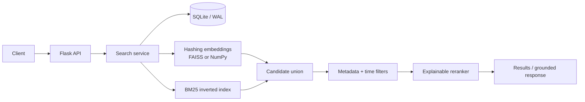

# Semantic Search Platform

[](https://github.com/brohum10/semantic-search-platform/actions/workflows/ci.yml)
[](https://www.python.org/)
[](#quality)
[](LICENSE)

An explainable, local-first retrieval service that combines dense vector similarity, BM25 lexical relevance, recency, and structured filters. Messages are durable in SQLite, vectors use FAISS when available (with an exact NumPy fallback), and every result shows why it ranked.

## Why this is more than a vector-search demo

- **Hybrid retrieval:** unions dense and lexical candidates before reranking, so exact IDs such as `INC-4812` are not lost to embedding behavior.
- **Explainable ranking:** returns raw cosine/BM25 values, matched terms, and each weighted score contribution.
- **Structured filtering:** supports nested metadata equality plus inclusive creation-time windows without bypassing ranking.
- **Complete document lifecycle:** durable batch ingestion, point lookup, deletion, and deterministic in-memory index reconstruction on restart.
- **Source-grounded responses:** creates query-focused extractive answers with citations and an explicit confidence band—no fabricated generation.
- **Operational boundaries:** one-megabyte request limit, 1,000-message batch cap, bounded result sizes, consistent JSON errors, request IDs, health checks, and runtime statistics.
- **Portable deployment:** zero external services by default, optional FAISS acceleration, non-root Docker runtime, persistent volumes, and health checks.

## System at a glance



The full design, consistency model, scoring formula, complexity, and scale-out path are in [docs/architecture.md](docs/architecture.md). The HTTP contract is captured in [docs/openapi.yaml](docs/openapi.yaml).

## Quick start

Requires Python 3.11 or newer.

```bash
python -m venv .venv
source .venv/bin/activate
python -m pip install -e '.[dev]'
semantic-search
```

Install the optional FAISS backend with `python -m pip install -e '.[dev,faiss]'`. Without it, the service automatically uses exact NumPy search.

Index a message:

```bash
curl -X POST http://localhost:8080/v1/messages \
  -H 'Content-Type: application/json' \
  -d '{
    "content": "Retries use capped exponential backoff and idempotency keys.",
    "metadata": {"team": {"name": "platform"}, "environment": "production"}
  }'
```

Run a filtered hybrid search:

```bash
curl -X POST http://localhost:8080/v1/search \
  -H 'Content-Type: application/json' \
  -d '{
    "query": "How should production writes be retried?",
    "limit": 5,
    "filters": {
      "metadata": {"team.name": "platform"},
      "created_after": "2026-01-01T00:00:00Z"
    }
  }'
```

Each result includes `similarity`, normalized `lexical` and `recency` signals, `matched_terms`, the final `score`, and an `explanation` with individual contributions.

## API

| Method | Route | Purpose |
|---|---|---|
| `POST` | `/v1/messages` | Validate and index one message |
| `POST` | `/v1/messages/bulk` | Index up to 1,000 messages in one SQLite transaction |
| `GET` | `/v1/messages/{id}` | Fetch one durable message |
| `DELETE` | `/v1/messages/{id}` | Delete a message from storage and both indexes |
| `GET` | `/v1/search?q=...&limit=...` | Simple hybrid search |
| `POST` | `/v1/search` | Hybrid search with nested metadata and time filters |
| `POST` | `/v1/respond` | Query-focused extractive response with ranked sources |
| `GET` | `/v1/health` | Liveness, document count, and vector backend |
| `GET` | `/v1/stats` | Index size, vocabulary, dimensions, and ranking weights |

Error responses use a stable shape such as `{"error":{"code":"invalid_request","message":"..."}}`. Every response also carries an `X-Request-ID`; callers may supply their own for correlation.

## Configuration

| Environment variable | Default | Purpose |
|---|---:|---|
| `SEARCH_DATABASE` | `data/messages.db` | SQLite database path |
| `SEARCH_MAX_REQUEST_BYTES` | `1048576` | Maximum HTTP request size |
| `PORT` | `8080` | Development server port |

For a containerized run:

```bash
docker compose up --build
```

The Compose volume retains the database across restarts. In-memory indexes are rebuilt deterministically from SQLite during startup.

## Quality

```bash
python -m pip install -e '.[dev]'
ruff format --check .
ruff check .
pytest --cov=semantic_search --cov-report=term-missing
```

The suite contains 32 deterministic tests and enforces at least 85% branch coverage (the current implementation exceeds 95%). CI runs linting and tests on Python 3.11, 3.12, and 3.13 and separately verifies the production container build.

## Reproducible benchmark

```bash
semantic-search-benchmark \
  --messages 100000 \
  --queries 500 \
  --dimension 512 \
  --output benchmarks/latest.json
```

The benchmark indexes a deterministic labeled corpus through the same service path as the API and measures Recall@10, mean reciprocal rank, throughput, and p50/p95/p99 query latency.

Latest local run on an arm64 Mac (September 1, 2026):

| Documents | Queries | Indexing throughput | Recall@10 | MRR | p50 | p95 | p99 |
|---:|---:|---:|---:|---:|---:|---:|---:|
| 100,000 | 500 | 12,649.6 docs/s | 1.0000 | 1.0000 | 14.728 ms | 16.625 ms | 19.697 ms |

[benchmarks/latest.json](benchmarks/latest.json) is generated by that command; it is not a hand-edited performance claim. Synthetic results demonstrate implementation behavior, not relevance on a production dataset.

## Deliberate tradeoffs

The built-in feature-hashing embedder makes the entire project reproducible without model downloads, API keys, or network access. It is an engineering baseline, not a claim that feature hashing outperforms neural embeddings. The embedding boundary can be replaced by a sentence-transformer or hosted model without changing storage, BM25 retrieval, filters, reranking, tests, or the API contract.

SQLite plus exact indexes are an excellent fit for a single-node corpus. The architecture document explains the migration path to PostgreSQL, object-backed snapshots, background indexing, approximate nearest-neighbor search, and replicated stateless API workers when the workload outgrows that boundary.

## License

[MIT](LICENSE)
