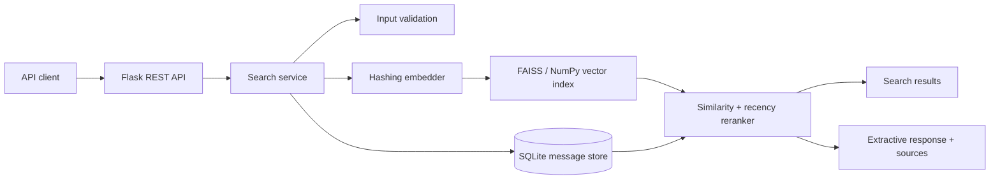

# Architecture



## Component boundaries

- **API:** translates HTTP requests into validated service calls and returns consistent JSON errors.
- **Search service:** owns ingestion, candidate retrieval, recency-aware reranking, and extractive response composition.
- **Embedder:** creates deterministic, normalized vectors with feature hashing. It is deliberately replaceable with a neural embedding provider.
- **Vector index:** uses FAISS `IndexFlatIP` when installed and a NumPy exact-search fallback for portability.
- **Message store:** persists content, timestamps, and metadata in SQLite using WAL mode and parameterized queries.

## Ranking

Candidate retrieval uses cosine similarity over normalized vectors. The final score combines vector relevance, freshness, and a small exact-token signal:

```text
0.85 * normalized_similarity + 0.10 * exponential_recency_score + 0.05 * lexical_overlap
```

The recency component has a configurable 30-day half-life. Retrieving more candidates than the requested top-k prevents the reranker from considering only the vector top-k, while the lexical component makes exact identifiers and technical terms more stable.

## Tradeoffs and next steps

The built-in hashing embedder keeps the repository reproducible without model downloads or API keys. A production system would inject a neural embedding adapter, use an approximate FAISS index such as HNSW or IVF for a much larger corpus, add background index snapshots, and place authentication plus per-client rate limits in front of ingestion.
