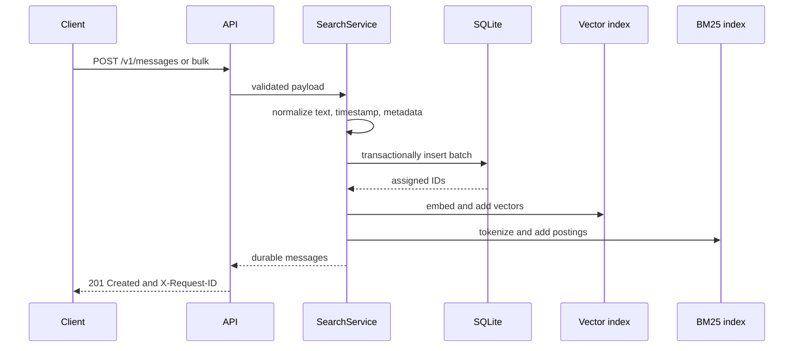
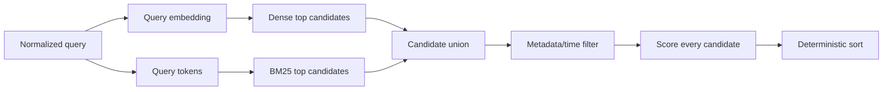

# Architecture

## Goals and boundaries

This service optimizes for explainable retrieval, deterministic local operation, and a clean replacement path for each infrastructure component. It intentionally does not pretend that an embedded database and exact in-memory indexes are a distributed search cluster.

The durable source of truth is SQLite. FAISS/NumPy and BM25 are derived read models rebuilt from stored messages at process startup. A service-level reentrant lock prevents a search from observing half of an in-process index update or deletion.

## Write path



Input constraints bound memory and abuse: 10,000 characters per message, 20 KB of serialized metadata, 1,000 messages per batch, and a configurable HTTP request limit. Metadata must be JSON serializable before the transaction begins.

SQLite commits before derived indexes update. Embedding and index-shape failures are prevented by validation and deterministic local code, but a process kill in that narrow interval can leave the current process incomplete. Restart recovery resolves it because both indexes are rebuilt from SQLite. A production multi-process deployment would use an outbox plus versioned background indexing rather than relying on this single-process boundary.

## Read path and ranking



Dense retrieval uses cosine similarity over normalized vectors. BM25 uses `k1=1.5` and `b=0.75`. Terms present in more than 80% of documents are omitted when at least one more-selective query term exists; this prevents corpus-wide postings for generic words from dominating latency without discarding the only available lexical signal. The reranker normalizes cosine from `[-1, 1]` into `[0, 1]`, normalizes BM25 against the strongest lexical candidate, and applies exponential time decay with a 30-day half-life:

```text
score = 0.70 * normalized_cosine
      + 0.20 * normalized_bm25
      + 0.10 * 2 ^ (-age_days / 30)
```

The response exposes the raw cosine and BM25 values and all three weighted contributions. Ties are broken by message ID for repeatable results.

Filtered searches inspect the full local corpus so a highly selective metadata filter cannot incorrectly return too few results merely because matching documents missed an unfiltered top-k. This favors correctness at the repository's single-node scale; production filters should be pushed into a database or filter-aware ANN index.

## Component responsibilities

| Component | Responsibility | Replaceable with |
|---|---|---|
| Flask API | HTTP translation, request IDs, bounded payloads, error contract | FastAPI or gRPC adapter |
| `SearchService` | Validation, lifecycle consistency, candidate union, filtering, ranking | Application service unchanged by adapters |
| `HashingEmbedder` | Deterministic normalized local vectors | Sentence Transformers or hosted embeddings |
| `VectorIndex` | Thread-safe exact cosine candidates; FAISS acceleration | HNSW/IVF, pgvector, managed vector DB |
| `Bm25Index` | Incremental postings, document statistics, lexical candidates | OpenSearch, Elasticsearch, Tantivy |
| `MessageStore` | WAL-mode durable messages and metadata | PostgreSQL or document store |

## Complexity

- Ingestion is `O(tokens + dimension)` per document, excluding SQLite I/O.
- Exact NumPy/FAISS-flat dense search is `O(n * dimension)`.
- BM25 query work is proportional to the postings visited by query terms.
- Deletion rebuilds the flat FAISS view and is `O(n * dimension)`; appropriate for a read-heavy local corpus.
- Metadata-filtered search is `O(n)` by design for correctness at this scale.

## Operations and security

- The application runs as a non-root container user and Compose enables `no-new-privileges`.
- Docker and Compose health checks call `/v1/health`.
- `/v1/stats` reports counts and configuration without exposing document content.
- Responses include `X-Request-ID` and `X-Content-Type-Options: nosniff`.
- SQL values are parameterized, metadata is serialized before storage, and request/batch/result sizes are bounded.
- Authentication, authorization, TLS termination, tenant isolation, and distributed rate limiting belong at the ingress/service layer and are intentionally not faked in this local project.

## Scale-out path

1. Introduce an embedding-provider interface with batching, timeouts, retry budgets, and model-version metadata.
2. Write messages plus an outbox event transactionally in PostgreSQL.
3. Let idempotent workers update versioned dense and lexical indexes; track indexed offsets.
4. Snapshot indexes to object storage and atomically swap read replicas to new versions.
5. Make API processes stateless, add tenant-aware authorization/rate limits, and report RED metrics and traces.
6. Evaluate retrieval with a versioned human-labeled dataset before changing models or weights.

These steps preserve the current HTTP and service contracts while replacing local implementations behind them.
